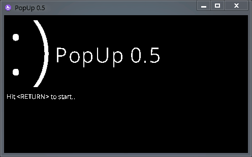

<h1 align="center">
  PopUp 
  
  
  
   
  
  
  
   
  

   
  
</h1>

**Under Development (WIP)**

A simple popUP game where your work is to close as many popups you can!

GAME OVER on 15 popups

Written in [Wren](https://wren.io) with [Dome Engine](https://domeengine.com)

## Credits

OpenSans Font (c) 2022 Open Sans
