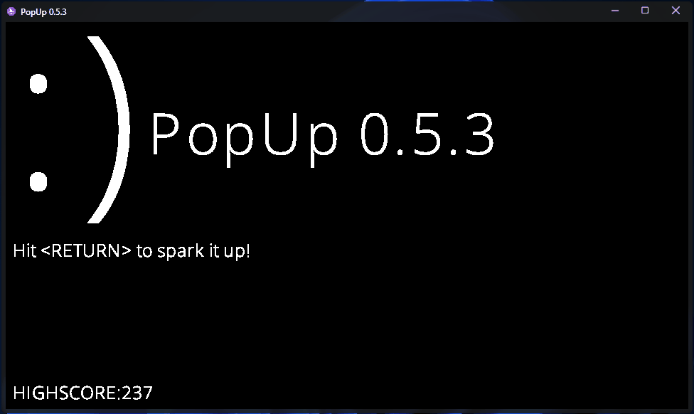

<h1 align="center">
  PopUp
  

  
  
  
   
  
  
   
  
  
   
  
</h1>

A simple popUP game where your work is to close as many popups you can!

GAME OVER on 15 popups

## Building

The file `build.cmd` has the only two lines of code you need to get it up and running.

## Credits

[Bob Nystorm](http://journal.stuffwithstuff.com/) ([munificent](https://github.com/munificent)) for the awesome [Wren](https://wren.io) programming language

[avivberri](https://github.com/avivberri) for making DOME!

Domeengine's discord: A community build by people who love DOME.

## Resource used
OpenSans Font (c) 2022 Open Sans
