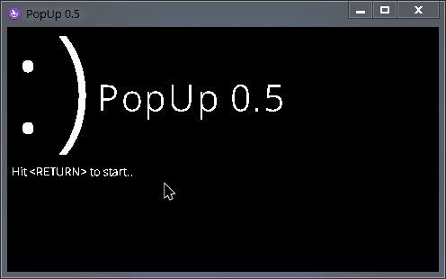

<h1 align="center">
  PopUp
  

  
  
  
   
  
  
   
  
  
   
  
</h1>

A simple popUP game where your work is to close as many popups you can!

GAME OVER on 15 popups

# TODO
1. Add many more types of popups (2 as of now)
2. Background music
3. 2 options on each popup (ex: Ok, Cancel)

## Credits

OpenSans Font (c) 2022 Open Sans
